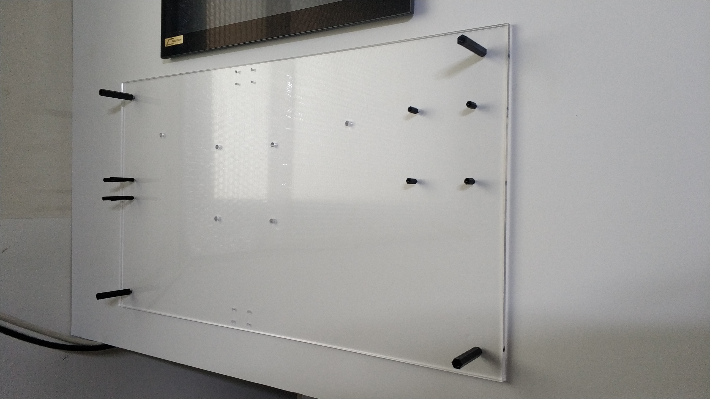
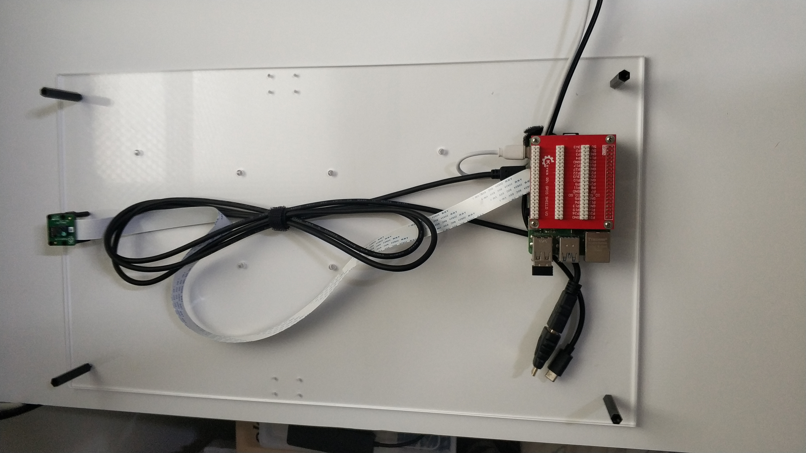
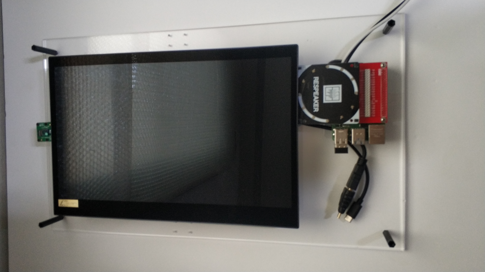

# 2021 하드웨어 해커톤 탑메이커

## 팀명 : AinPeople(팀장 : 강동훈, 팀원 : 임도현, 윤태경, 최준영), 팀저장소 : https://github.com/2021TopMaker-AinPeople
## 프로젝트명 : AinMirror - 동화를 현실로 스마트미러 DIY 키트(feat. 백설공주)
## AinMirror 프로젝트 소스코드 저장소 : https://github.com/2021TopMaker-AinPeople/AinMirror

## 프로젝트 주요내용
* 사물인터넷(IoT) 관련 프로젝트에서 가장 많이 활용되고 있는, 라즈베리파이 판매량이
최근 누적 3천만대를 돌파하였지만, 운영체제(OS)는 기존 데스크탑 리눅스와 유사한
라즈베리 파이 OS를 공식적으로 제공하고 있음, 이로 인해 IoT기기에 적합하지 않은
사용자 인터페이스(UI)와 시스템을 사용하게 됨
* 기존 데스크탑 OS(리눅스, Windows 10)나 스마트폰 OS(안드로이드) 또한 라즈베리파
이로 이식되었으나, 공식적으로 지원하는 OS가 아니며, 라즈베리 파이 OS와 마찬가
지로 IoT기기에 적합하지 않음
* 최근 만화나 동화 속에 나오던 자율주행 자동자, 말하는 스피커 등, 상상으로만 존재
하던 많은 IoT 기기들이 속속 등장하고 있음, 이에 따라 어느 때보다 IoT 기기들에
대한 일반인들의 관심이 높아지고 있으며, 이와 관련된 각종 개발 키트와 교육들이
활발하게 만들어지고 있음
* 거울은 많은 사람들에게 친숙한 스마트폰, 태블릿과 유사한 직사각형 폼 팩터(form
factor)를 가지고 있으며, 백설공주라는 유명 동화를 통해서 많은 사람들이 꿈꾸고 있
는 IoT기기임
* 제안한 제품은 AR기술을 이용하여, 동화 속 스마트미러를 직접 현실로 만들어 볼 수
있는 DIY 키트임
카메라로 사용자 얼굴을 추적(face tracking)하여 사용자가 정의한 2D 오브젝트(아바
타 등)를 배치할 수 있음
* 음성명령을 통해서 사용자가 원하는 각종 정보(시간, 날씨 등)를 보여주고, 스마트싱
스(SmartThings) 등을 이용하여 다른 IoT 디바이스를 제어할 수 있음

## 해커톤 시작 사진촬영 : 

## 해커톤 작업장면 및 시작품 사진촬영 : 

## 팀 소개 및 팀프로젝트 소개영상(10분 내외) : https://www.youtube.com/watch?v=CKjwMcjn5Q4
[

## 최종 발표 시작품 데모 영상(3분) : https://youtu.be/CS3GM4PvxM4
[
